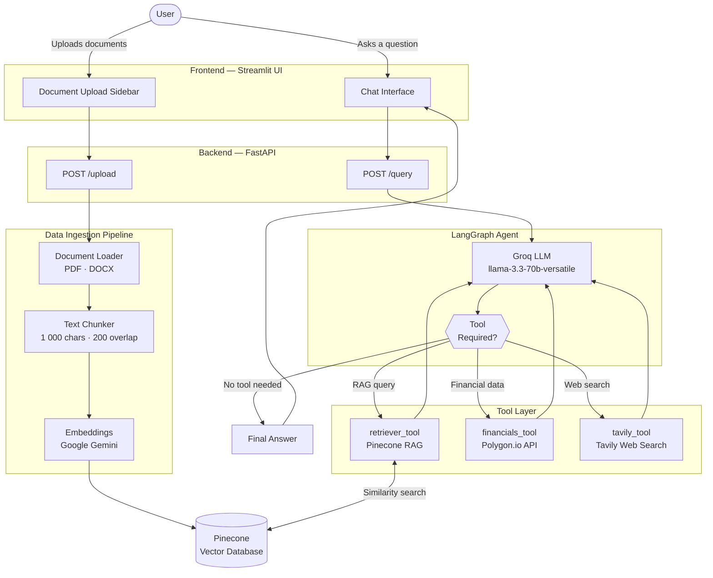
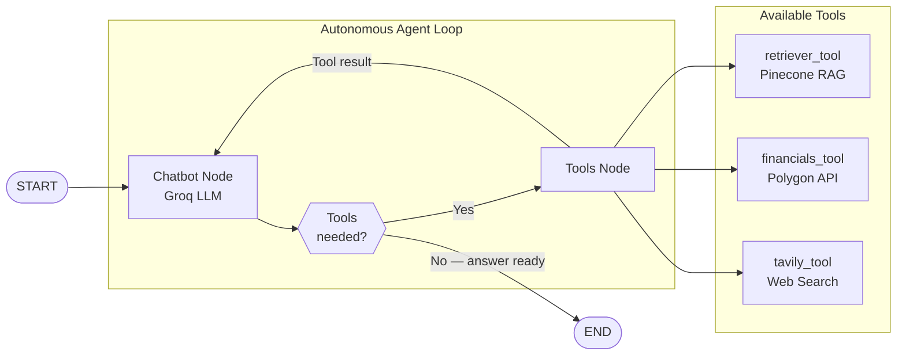

# Agentic Trading Bot

An AI-powered stock market assistant built on an **agentic architecture**. Users upload financial research documents (PDF, DOCX) to build a custom knowledge base, then ask natural language questions about stocks, financials, and market trends. A LangGraph agent autonomously decides which tool to use — RAG retrieval, live financial data, or web search — to produce accurate, context-aware answers.

---

## Table of Contents

1. [Key Features](#key-features)
2. [Tech Stack](#tech-stack)
3. [Architecture](#architecture)
4. [Setup](#setup)
5. [API Reference](#api-reference)
6. [Configuration](#configuration)
7. [Project Structure](#project-structure)
8. [Notes](#notes)

---

## Key Features

- Upload PDF or DOCX financial research documents into a vector database
- Ask questions in plain English about stocks, earnings, market trends, and more
- Agent autonomously selects the right tool per query — no hardcoded routing
- Streamlit chat UI with a FastAPI backend

---

## Tech Stack

| Layer | Technology |
|---|---|
| LLM | Groq — `llama-3.3-70b-versatile` |
| Embeddings | Google Gemini — `gemini-embedding-001` |
| Agent Framework | LangGraph (StateGraph with tool nodes) |
| Tools | Pinecone RAG retriever · Polygon Financials API · Tavily Web Search |
| Vector Database | Pinecone (Serverless, AWS us-east-1, cosine similarity) |
| Backend API | FastAPI + Uvicorn |
| Frontend UI | Streamlit |
| Document Loaders | PyPDF · Docx2txt |
| Config | YAML (`config/config.yaml`) |
| Environment | Python 3.10, Conda |

---

## Architecture

### System Overview



---

### Agent Decision Loop

The agent runs a dynamic loop — it keeps calling tools until it has enough context to produce a final answer. There is no fixed routing; the LLM decides at every step.



---

### Component Map

| Component | File | Role |
|---|---|---|
| FastAPI app | `main.py` | API endpoints (`/upload`, `/query`) |
| Agent graph | `agent/workflow.py` | LangGraph StateGraph builder |
| Tools | `toolkit/tools.py` | RAG retriever, Polygon, Tavily |
| Data ingestion | `data_ingestion/ingestion_pipeline.py` | Document loading → chunking → Pinecone |
| Model loader | `utils/model_loaders.py` | Loads Groq LLM and Gemini embeddings |
| Config | `config/config.yaml` | Centralized settings (model names, top-k, etc.) |
| Streamlit UI | `streamlit_ui.py` | Chat interface + document upload sidebar |

---

## Setup

### Prerequisites

- Python 3.10
- Conda (recommended) or venv
- API keys for all required services (see Step 4)

### Step 1 — Clone the Repository

```bash
git clone https://github.com/Shyam-AI-Engineer/Agentic-Trading-Bot.git
cd Agentic-Trading-Bot
```

### Step 2 — Create and Activate the Environment

**Using Conda (recommended):**
```bash
conda create -p env python=3.10 -y

# Windows CMD
conda activate <full_path_to_env>

# Git Bash / Linux / macOS
source activate ./env
```

**Using venv:**
```bash
python -m venv venv

# Windows
venv\Scripts\activate

# Linux / macOS
source venv/bin/activate
```

### Step 3 — Install Dependencies

```bash
pip install -r requirements.txt
```

### Step 4 — Configure Environment Variables

Create a `.env` file in the project root:

```env
POLYGON_API_KEY=your_polygon_api_key
GOOGLE_API_KEY=your_google_api_key
TAVILY_API_KEY=your_tavily_api_key
GROQ_API_KEY=your_groq_api_key
PINECONE_API_KEY=your_pinecone_api_key
```

| Key | Purpose | Where to get it |
|---|---|---|
| `POLYGON_API_KEY` | Stock financial data | https://polygon.io |
| `GOOGLE_API_KEY` | Gemini embeddings | https://aistudio.google.com |
| `TAVILY_API_KEY` | Live web search | https://tavily.com |
| `GROQ_API_KEY` | Fast LLM inference | https://console.groq.com |
| `PINECONE_API_KEY` | Vector database | https://pinecone.io |

### Step 5 — Run the Backend

```bash
uvicorn main:app --host 0.0.0.0 --port 8000 --reload
```

- API: `http://localhost:8000`
- Interactive docs: `http://localhost:8000/docs`

### Step 6 — Run the Frontend

Open a second terminal (with the environment active):

```bash
streamlit run streamlit_ui.py
```

- UI: `http://localhost:8501`

---

## API Reference

### `POST /upload`
Upload one or more PDF or DOCX files to build the knowledge base.

**Request:** `multipart/form-data` with one or more files

**Response:**
```json
{ "message": "Files successfully processed and stored." }
```

---

### `POST /query`
Ask a question to the trading bot.

**Request:**
```json
{ "question": "What is the revenue of Apple for Q3 2024?" }
```

**Response:**
```json
{ "answer": "Apple's revenue for Q3 2024 was $85.8 billion..." }
```

---

## Configuration

All model and retriever settings live in `config/config.yaml`:

```yaml
vector_db:
  index_name: "trading-bot"       # Pinecone index name

retriever:
  top_k: 3                        # Number of chunks retrieved
  score_threshold: 0.5            # Minimum similarity score

embedding_model:
  model_name: "gemini-embedding-001"

llm:
  groq:
    model_name: "llama-3.3-70b-versatile"

tools:
  tavily:
    max_results: 5
```

---

## Project Structure

```
Agentic-Trading-Bot/
├── agent/
│   └── workflow.py                  # LangGraph StateGraph definition
├── config/
│   └── config.yaml                  # Centralized configuration
├── custom_logging/                  # Logging utilities
├── data_ingestion/
│   └── ingestion_pipeline.py        # PDF/DOCX → chunk → embed → Pinecone
├── data_models/
│   └── models.py                    # Pydantic request/response models
├── exception/
│   └── exceptions.py                # Custom exception handlers
├── fallback_data/                   # Fallback response templates
├── prompt_library/                  # Prompt templates for the LLM
├── toolkit/
│   └── tools.py                     # LangChain tools (RAG, Polygon, Tavily)
├── utils/
│   ├── config_loader.py             # YAML config loader
│   └── model_loaders.py             # LLM + embedding initializer
├── main.py                          # FastAPI application entry point
├── streamlit_ui.py                  # Streamlit chat frontend
├── requirements.txt
├── setup.py
└── .env                             # API keys — never commit this file
```

---

## Notes

- The Pinecone index is created automatically on the first upload (dimension: 3072, metric: cosine, region: AWS us-east-1).
- Groq handles all LLM inference; Google Gemini is used exclusively for generating embeddings.
- Never commit your `.env` file — ensure it is listed in `.gitignore`.
- CORS is currently set to `allow_origins=["*"]`. Restrict this to specific origins before deploying to production.
